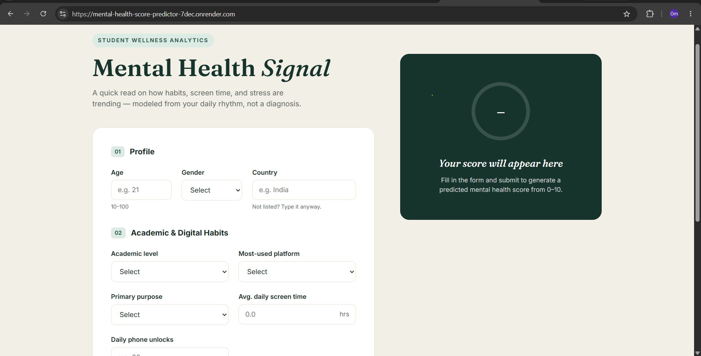
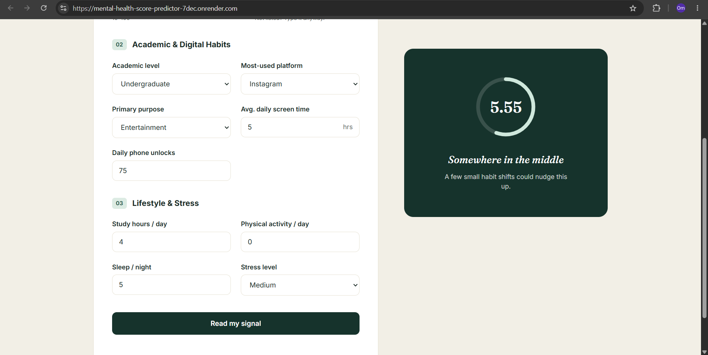

# 🧠 Mental Health Score Predictor

A Machine Learning web application that predicts a student's **Mental Health Score** based on lifestyle, academic, and social media usage habits.

🌐 **Live Demo:**  
https://mental-health-score-predictor-7dec.onrender.com

---

## ✨ Features

- 🧠 Predict Mental Health Score (0–10)
- ⚡ FastAPI REST API
- 📊 Machine Learning Regression Model
- 🎨 Responsive User Interface
- 🌍 Live Deployment on Render

---

## 🛠️ Tech Stack

- Python
- Scikit-learn
- Pandas
- FastAPI
- HTML
- CSS
- JavaScript
- Render

---

## 📸 Preview


### Home Page



### Prediction Result



---

## 🚀 Run Locally

```bash
git clone https://github.com/Ombankar1111-gi/mental-health-score-predictor.git

cd mental-health-score-predictor

pip install -r requirements.txt

uvicorn main:app --reload
```

Open:

```
http://127.0.0.1:8000
```

---

## 📂 Project Structure

```
Mental-Health-Score-Predictor
│── main.py
│── Mental_Health_Model.pkl
│── requirements.txt
│
├── templates
│   └── index.html
│
├── static
│   ├── style.css
│   └── script.js
```

---

## 👨‍💻 Author

**Om Bankar**

⭐ If you like this project, don't forget to star the repository.
